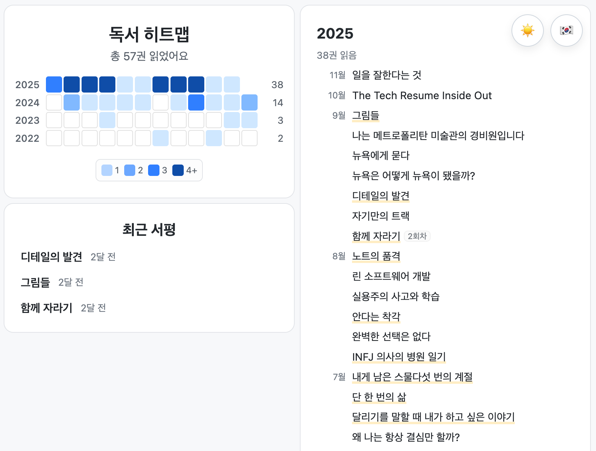

# Books & Reviews Site

<p align="center">

<p/>

독서 기록만 `books.csv`에 작성하면 자동으로 리스트와 GitHub-style 히트맵을 만들어 주는 정적 사이트 템플릿입니다. 책 후기(블로그 형식)도 `_posts`에 Markdown으로 추가할 수 있어, 읽은 책과 후기를 한곳에서 관리합니다.
언어(🇰🇷/🇺🇸)와 다크 모드(🌙/☀️) 토글을 제공하며, 같은 책을 여러 번 읽으면 최신 기록에 `N회차` 배지가 표시됩니다.

## 시작하기

1. 템플릿을 fork/Use this template로 복사합니다.
2. `books.csv.example`를 `books.csv`로 복사해 내용을 채웁니다. 컬럼 순서: `title, english-title, year, month`.
3. `favicon.ico`를 교체하면 탭 아이콘이 바뀝니다.

## GitHub Pages 배포

1. 저장소를 public으로 만든 뒤 GitHub → **Settings → Pages** 로 이동합니다.
2. **Source**를 “Deploy from a branch”, **Branch**를 `main`으로 설정하면 자동으로 정적 사이트가 배포됩니다.

이후 개인 fork에서 `books.csv`와 `favicon.ico`만 유지한 채 upstream 업데이트를 쉽게 받아 새로운 스타일이나 기능을 적용할 수 있습니다.

## 디버깅하기

- 로컬에서 보기: `bundle install` 후 `bundle exec jekyll serve --future`.
- 빌드가 막힐 때: Liquid 에러는 `_posts` 파일의 잘못된 ``나 프론트매터를 확인하세요.
- 캐시 초기화: `_site`, `.jekyll-cache`, `vendor`, `.bundle`을 지우고 다시 실행.

## 책 후기 작성하기

- `_posts/YYYY-MM-DD-slug.md` 형태로 파일을 추가합니다. 예시:

```
---
permalink: /slug
date: 2025-09-20
title: 제목
author: 저자명
publication_year: 2024
detail: true # 정독 후기면 true, 아니면 생략/false
---

본문을 Markdown으로 작성하세요. 중첩 리스트, 코드 블록, 이미지(`assets/` 경로) 등을 지원합니다.
```

- 목록: `/books/reviews/`에서 후기 목록을 확인하고, 개별 파일은 퍼머링크(`/slug`)로 이동합니다.
- 후기 데이터는 빌드 시 Jekyll이 `src/reviews-data.js`(전역 `window.REVIEWS`)를 자동 생성합니다.
