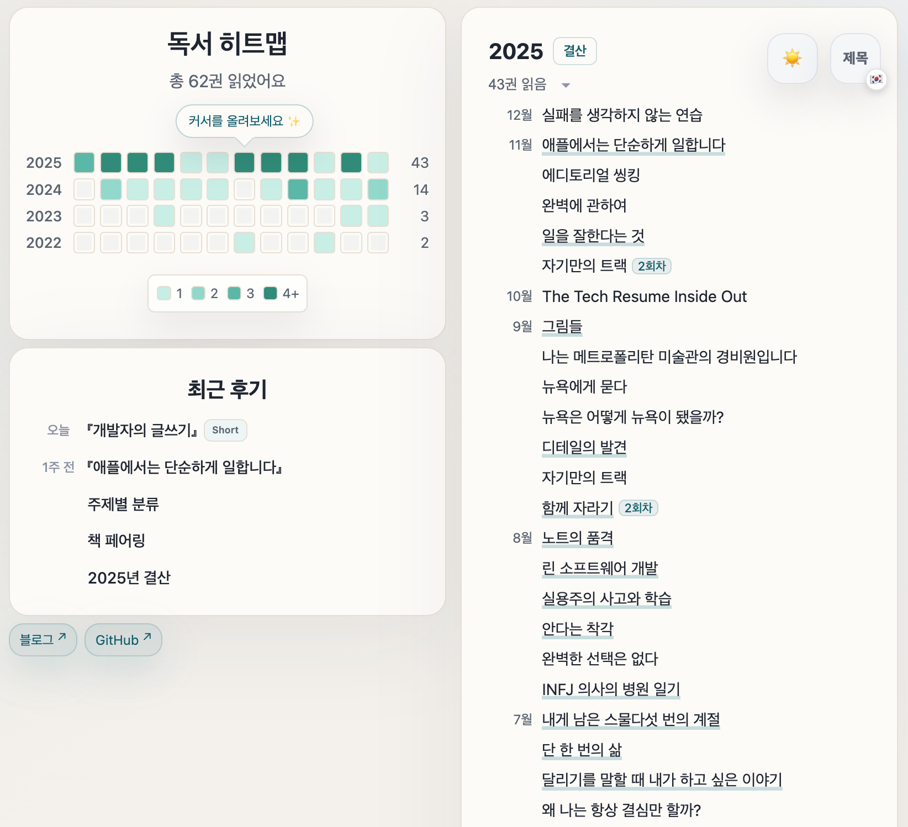

# Books & Reviews Site

<p align="center">

<p/>

독서 기록은 `books.csv`, 후기는 `_posts`에 Markdown으로 추가합니다. 리스트·히트맵·후기 목록이 자동 생성되며 언어/다크 모드 토글과 N회차 표시를 지원합니다.

## 시작하기
- `books.csv`에 기록을 입력합니다. 컬럼: `title, english-title, year, month`.
- `favicon.ico`를 교체해 탭 아이콘을 변경합니다.

### 책 후기 작성하기
- `_posts/YYYY-MM-DD-slug.md` 파일을 추가합니다. 예시:

```
---
permalink: slug
date: 2025-09-20
title: 제목
author: 저자명
publication_year: 2024
detail: true # 정독 후기면 true, 아니면 생략/false - 생략은 후기 목록에서 Short가 표시됨.
---

본문을 Markdown으로 작성하세요.
```

## 사이트 관리

### 배포 전 디버깅
- 로컬 Deploy: `bundle install` 후 `bundle exec jekyll serve`.

### GitHub Pages 배포
1. 저장소를 public으로 만든 뒤 GitHub → **Settings → Pages**로 이동합니다.
2. **Source**를 “Deploy from a branch”, **Branch**를 `main`으로 설정합니다.